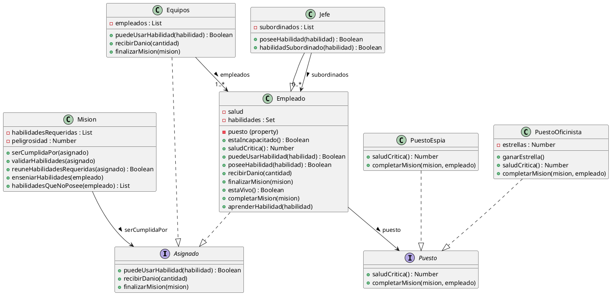

## Link a plantuml

https://www.plantuml.com/plantuml/uml/jPDHZjCm48RVSmfhNqY1x05M8jfIWWZQBL737c0QJxSZkNRMOx_0SWgEnCK8SU845VQbhP-YNvcnv_l_kMK7rlc3Ibw9ToUShlmVfrn_BJOVbwkY5YbOIriG4eKpqYnElIyXxT3ke46nP7hK88tudeZkl6azIdnWiEb-4HIB3Mt9VW1D9cq6SKSQ57q3UqzCHgU7HV9ZthRoo2usRSoXLUYclzyAx0lEpwr-g8hDwcvPTzYgJRbUbTNohgXF9jOeO1R5dpacMXc3yZ9yxc5BYYH8v22qFO9JgHxpYxJZOwwld_Dev2HdMJxwS2CSeKQHnq6UFBLn31nA-0mP29t_VbCGmukkNbzD66z4l5habuX3JCNxa8apvU0pxZ1cm6-DbQHd_0mZVXhpaEvxBdr9bZtdSVfHEc8oxpYpZ5k2_szKMAZmwvSTDQI97KI7sLbK2lZbyd17xrr8JZArcikNi-g-hCjVFzTdyYcCDq9eKT6ZDKmIZfTsWqyUBSaH4QDT-OvIfrJ6fZ14kSSqjCso8UB1Di_GkNMBMlg3-Wq0

## Diagrama para copiar

