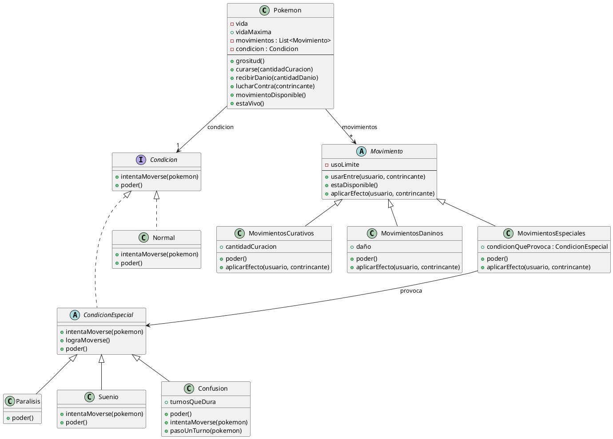

## Link a plantuml

https://www.plantuml.com/plantuml/uml/hLN1Rjim3BtxAuHUbcvpWLs7hkZW-12iYLkawvsHbOwOBHgY50pezb7xXltOfCIMqpZ9idM-H2OV-SX7Mhbc2yQwkagIL-B3WSUxrazsyt6UYzlYKpujPiVmYQo0MTpILrMJ5az9Y4x52ajO7z-iZrFuXZMqlffMMAFIbbYy5pV8zd8QJLSjI98kKI9f3ycwyyQNjeaV3J5QLuxEMuDq1WohaGHjFMcP-VSGrlcDahX0CmQD547hjmvHEVa5ZEUp1aOo_A0EGDK1-jh7o0rfN5GgyYksy80hyeOVIT99agPNukpTcSZwZlhkdgDUdubU2G_RKYevPMf2J8k7oNIIp-wB-T6fmOAj0Md5PdmzQvoWOxhnDgkUY-uOJEvrKIF73WpIMp7GgPLYZqBGL2XzWgMIbWvbyDhjLiLXbDPBo-AfJRKxvDRSKAdCo_d2LkWjjX9-_QJ_Iv5peoH2fNgMk1PtJjqQMf64xVNl8bvKnzQeBx-dwLwH1w2XCiSWVMT9ijSSjdtObc-rsJITdBZjMJ4RJx99CSkFRplwviqIfEf9e-R1fotuEbMuEvhDztY-et4Su8nC3TNVHqTYhzR5HPic6No8Gr5EOwheqKJV7-c7D6l1vsuHgb0SjaOQPO6xwnqCLCWOLtKepDmfZVIlilg2bewtvsATqSHtJesTWPsmaoY0wRE-3rbwb-SRAXpMj-_m0A3jxv0trk-5l5Qw37-plm40

## Diagrama para copiar

